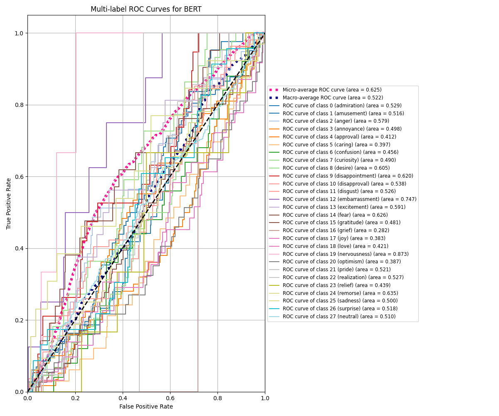
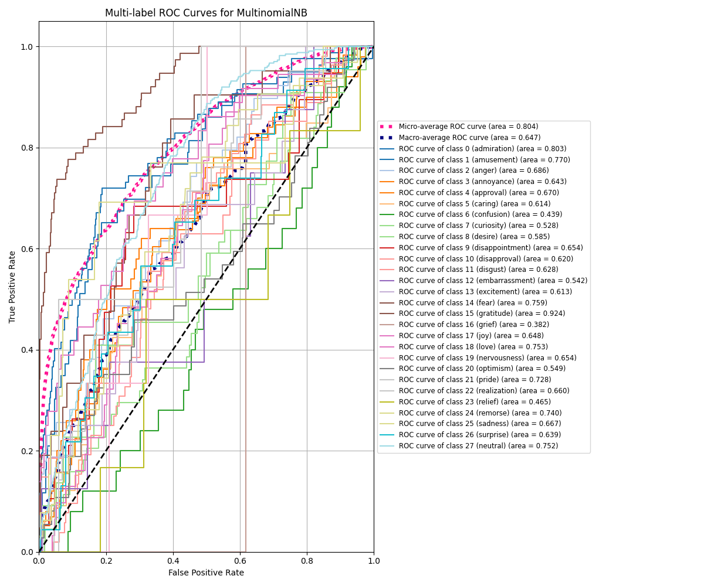
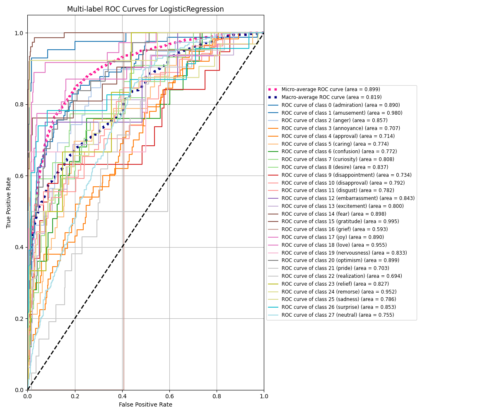

# Final Project: Emotion Classification

## Update: in my own personal repository, I have changed the model to RoBERTa distilled. I have all the training code set up to augment data to account for emotions that are less frequent, and I will train it on the full dataset next.

I have completely changed up my final project idea. I will now be using another dataset from HuggingFace to clasify emotions from a piece of text--there just was not enough to analyze with my previous project.

This new project is branched off from my personal project, where I am fine tuning an LLM to detect emotions using BERT. I have adapted my project for this final.

## Goal

The classification of emotions from text data provided by the GoEmotions dataset. This is a **multi-label classification task**. The objective is to train a model that can predict a set of relevant emotions for a given input text, similarly to what was seen in the dataset.

## ML Algorithms

1.  **Fine-tuned BERT (Bidirectional Encoder Representations from Transformers):**

    - BERT is a large pre-trained transformer model that excels at understanding text context. I use the `bert-base-uncased` model and fine-tune it on the GoEmotions dataset by adding a classification head (layer with sigmoid activation for multi-label). Transformer models can capture complex semantic relationships in text, and fine-tuning allows leveraging the knowledge learned during pre-training and adapting it to the emotion domain.

2.  **Logistic Regression with One-vs-Rest (OvR):**

    - A linear model commonly used for binary classification. The One-vs-Rest strategy involves training a separate binary LR classifier for each of the 28 emotion labels. Each classifier predicts the probability of its specific emotion being present. Input features would be TF-IDF (Term Frequency-Inverse Document Frequency) representations of the text. LR is a strong baseline algorithm. It's computationally efficient and provides probabilistic outputs. Using it with TF-IDF features is a standard approach for text classification, and it's as a good benchmark to evaluate the more complex models like BERT. The OvR strategy also adapts it for multi-label problems.
    - Term Frequency (TF): How often a word appears in a single document.
    - Inverse Document Frequency (IDF): How rare a word is across all documents. Words that appear in many documents get a lower IDF score.

3.  **Multinomial Naive Bayes (MNB) with One-vs-Rest (OvR):**
    - A classifier based on Bayes' theorem, commonly used for text classification. It assumes independence between features. Similar to Logistic Regression, the OvR strategy trains 28 independent binary MNB classifiers on TF-IDF features. MNB is computationally efficient and often performs well on text data. It's another strong baseline to compare, and it helps understand if the linear separation of LR or the contextual understanding of BERT is necessary for better performance.

## Data Prep

### BERT

1.  **Load Data:** Fetches the dataset split ("simplified") from HuggingFace.
2.  **Subset Selection:** Selects a specified number of examples for training and testing so my Mac doesn't explode.
3.  **Tokenization:** Transform text into tokens to feed into LLMs; a standard process. Applies this in batches so my Mac doesn't explode.
4.  **Multi-Hot Label Encoding:** A custom transformation that converts the list of integer labels into a fixed-size binary vector. (needed for the`BinaryCrossentropy` classification used with BERT)
5.  **Column Management:** Clean up the dataset by removing original columns and renaming the newly created multi-hot vector column. Otherwise, there will be errors in parsing data.
6.  **Sample Weight Calculation:** Calculates a weight for each training sample based on the rarity of the labels it contains. This will adjust and account for any biases in the dataset and class imbalance.
7.  **TensorFlow Dataset Conversion + Optimization:** Converts the data used into TensorFlow's format.
    I also shuffle the training data, groups samples into batches, and prefetch batches for best practice.

### MNB + LR

For implementing the MNB and LR baselines, I use Pipeline.

1.  **Binarize Data:** Transforms the lists of labels into the required binary multi-hot format.
2.  **Vectorize Text:** Converts the raw text into TF-IDF numerical features. This transformer is fitted only on the training data and then used to transform both training and test data.
3.  **OvR:** Wraps the base estimator to train an independent binary classifier for each of the 28 emotion labels.

## Eval Strategy

**Linear Correlations:** Text is first transformed into numerical representations, but the relationship between these high-dimensional features and the target emotion labels is typically complex and non-linear. BERT is designed to capture these non-linear contextual relationships, so we can analyze correlations between the predicted probabilities after training.

**Evaluation Metrics & ROC/AUC:**
Standard accuracy is insufficient because I deal with multi-label classification. I will use:

- **Binary Accuracy / Exact Match Accuracy:** Exact match accuracy is a strict metric that measures the percentage of samples where the predicted set of labels is exactly the same as the true set of labels.
- **Precision, Recall, F1-Score (Micro, Macro):** These provide insight into the model's performance across different labels, considering false positives and negatives. Micro-averaging aggregates contributions from all labels/samples, while Macro-averaging treats all labels equally (useful for imbalance).
- **AUC (Area Under the ROC Curve):** ROC curves are plotted for each label individually. The AUC provides a measure of the model's ability to distinguish between positive and negative instances for that label across various thresholds. We compute macro and micro-averaged AUC scores to get a sense of performance.

**Charts for Comparison:**
To determine which of the three chosen algorithms performs best,I generate ROC curves for all three trained models using their predicted probabilities on the test set.

**BERT ROC Curves:**

**Multinomial Naive Bayes ROC Curves:**

**Logistic Regression ROC Curves:**

### Analysis

Logistic Regression is the clear winner, followed by MNB, with BERT performing significantly worse than both baselines.

**BERT's Performance:**

- A Macro AUC of 0.5223 is barely above random chance. BERT has very little ability to distinguish positive from negative examples. The Micro AUC of 0.6247 is also quite low, suggesting poor performance even when considering all predictions together.
- Many of the faint lines representing individual emotion classes are clustered near the diagonal or are erratic. Very few push strongly towards the top-left corner. There is poor discriminative power across almost all emotions.

**MNB's Performance:**

- MNB shows respectable performance, especially in Micro AUC (0.8040). Its Macro AUC (around 0.647) suggests it struggles more with rarer classes than LR does.
- The lower macro-average curve pulls the average down. There's more spread than in BERT's plot. Some individual class curves are quite good, while others are closer to the diagonal.

**LR's Performance:**

- Logistic Regression performs surprisingly well, with a Micro AUC near 0.9 and a Macro AUC above 0.8. This indicates it generalizes effectively across both common and less common emotion labels using the TF-IDF features.

The result of this training is different from the expected. I predicted that BERT would have better classification due to being a more sophisticated model, but the bad performance may very likely be due to the amount of fine tuning that was made.

**Possibilities for BERT's Unexpected Performance:**

- The BERT curves look like a model that hasn't learned much beyond basic patterns. 5 epochs were probably insufficient for it to adapt its complex representations to this specific 28-label task with 10k samples.
- The excellent performance of LR strongly suggests that the TF-IDF features capture the relevant signals for this task very effectively. Simple word presence/frequency seems to be highly indicative of the emotions in this dataset/split, and the linear model (LR) exploits this well.
- BERT needs to learn complex contextual patterns, so if the dominant signal is simpler (like keywords captured by TF-IDF), BERT needs more data to learn that signal and then add contextual nuance on top.
