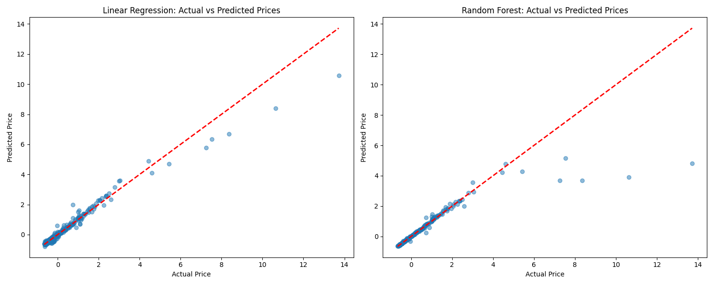
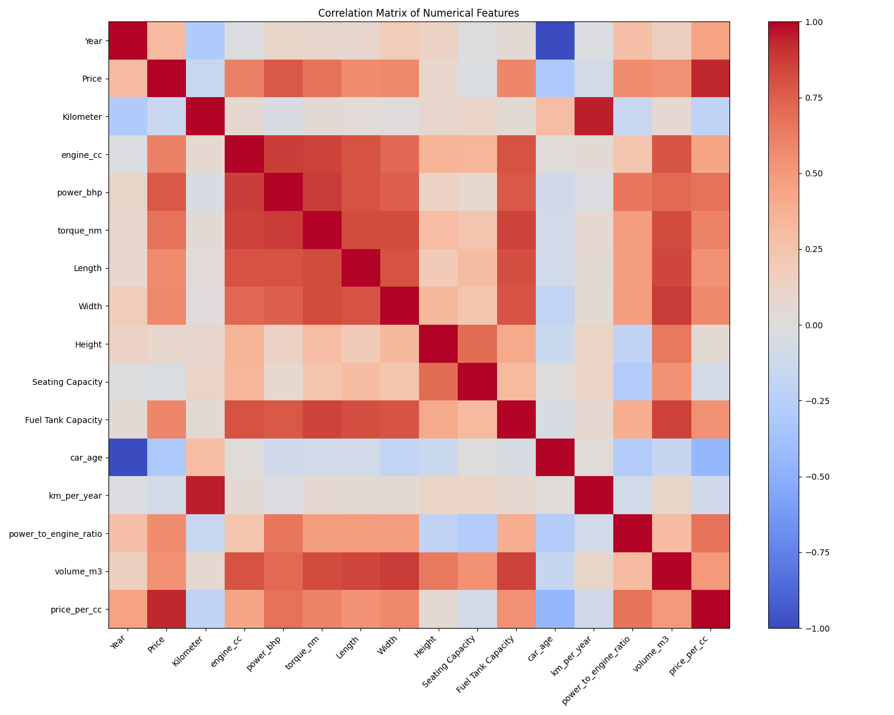

# ML Lab 1 Data report

## Data Preparation

I first played around with the data to get a better understanding of how different
pachages like pandas worked, like its head and tail functions. I made sure to get a
highly rated dataset to work with, so I was fairly confident in the cleanliness of the data.
However, I still made sure to check for missing values and duplicate rows and handle them
appropriately.

To make the data more useful for machine learning, I created new attributes that I thought
may be relevant to the price of a car and some others I could think of. I created a car
age attribute, kilometers per year attribute, and engine displacement attribute. I performed
various mathematical operations wherever I saw fit, such as the total volume of the car
and the ratio of the power to engine. I also extracted just the numeric values from
some of the columns, like the power and torque, to make them more usable when plotting.

## Feature Engineering

I used both one-hot encoding and ordinal encoding for the categorical variables. Because
one hot encoding creates a new column for each category, it allows parsing of
the data in a more useful way no matter its order without imposing false relationships.

One-hot encoding:
Make: Car brands
Fuel Type: Different fuel types are distinct categories
Transmission: Manual/Automatic are independent
Location: Cities
Color: Colors are independent
Seller Type: Individual/Corporate are distinct categories
Drivetrain: FWD/RWD/AWD are different mechanical configurations

As for ordinal encoding, it is used for variables with a natural order, like the owner
history of the car. It is more memory efficient than one-hot encoding for this ordered
category. For this dataset, there really is only the owner history that is ordered.

Ordinal encoding:
Owner: Encoded as First → Second → Third → Fourth → UnRegistered Car

## ML Models

The two models I used were linear regression and random forest. Linear regression tends to
be the most simple model, so I used it to get a baseline for the performance of the more
complex models. Random forest was my second choice because it is a model that effectively
handles non-linear relationships and can handle the categorical data better than linear
regression.

## Results

```python
Analyzing correlations between numerical features:

Top correlations with Price:
Price                    1.000000
price_per_cc             0.931737
power_bhp                0.776988
torque_nm                0.676773
engine_cc                0.609472
Fuel Tank Capacity       0.586109
Width                    0.577100
Length                   0.568875
power_to_engine_ratio    0.555963
volume_m3                0.535328
Year                     0.309381
Height                   0.092968
Seating Capacity        -0.024879
km_per_year             -0.076562
Kilometer               -0.147276
car_age                 -0.309381
Name: Price, dtype: float64

Training and testing the model:
Training set size: 1499 samples
Testing set size: 375 samples

Performing 5-fold cross-validation:

Linear Regression CV Scores:
R² scores for each fold: [0.97719033 0.97861146 0.98125912 0.96769532 0.97577541]
Mean R² score: 0.9761 (+/- 0.0092)

Random Forest CV Scores:
R² scores for each fold: [0.97424241 0.92815012 0.94783601 0.98227166 0.97066814]
Mean R² score: 0.9606 (+/- 0.0397)

Training final models on entire training set:

Model Performance Metrics:

Linear Regression:
Training R² score: 0.9828
Testing R² score: 0.9609
Training RMSE: 0.11
Testing RMSE: 0.28

Random Forest:
Training R² score: 0.9939
Testing R² score: 0.7740
Training RMSE: 0.07
Testing RMSE: 0.67

Top 10 Most Important Features (Random Forest):
           feature  importance
14    price_per_cc    0.788651
3        power_bhp    0.093007
2        engine_cc    0.039728
5           Length    0.033809
4        torque_nm    0.019746
153  owner_encoded    0.006041
1        Kilometer    0.002691
0             Year    0.002647
13       volume_m3    0.002033
6            Width    0.001603
```




## Conclusion

The linear regression model performed better than the random forest model, which was very surprising!
This is probably because the data is not very complex and the linear regression model is able to
capture the relationships between the features and the price of the car. The correlation matrix
shows that there are some features that are more strongly correlated with the price, making
it easier for the linear regression model to predict the price.
